# AI_Pitching_analysis_system
AI 기반 투구 및 타격 폼 분석 시스템입니다. 사용자가 업로드한 영상을 YOLO Pose를 사용해 스켈레톤을 추출 및 분석하고, 모델에 학습된 프로 선수들의 폼과 비교하여 유사도를 측정해주는 웹 서비스를 제공합니다.

## 팀원 소개 및 역할
- [한지호](https://github.com/Hanjiho0316): AI 모델 파트 담당 (모델 설계, 데이터 전처리 파이프라인 구축, 모델 학습, 모델 성능 검증, 서버 구축)
- [김재위](https://github.com/cheeserust): AI 모델 파트 (데이터 전처리, 모델 학습, 모델 비교 검증 및 테스트, 모델 성능 검증)
- [최민석](https://github.com/ManticoreXL): UI/UX 파트 담당 (백엔드 라우터 및 API 개발, 데이터베이스 연동, AI 모델 비동기 처리 및 서비스 연동)
- [문형철](https://github.com/hoic7824): UI/UX 파트 (웹 프론트엔드 화면 설계 및 구현)

##  실행 방법
1. 레포지토리 클로닝
```Bash
git clone https://github.com/Hanjiho0316/AI_Pitching_analysis_system.git
```

2. 패키지 설치
```Bash
pip install -r requirements.txt
```

3. 모델 배치
    학습이 완료된 모델 파일을 `AI_Pitching_analysis_system/UIUX/ml_models/`에 적재합니다. 모델 파일 이름은 config.py에서 정의할 수 있습니다.
    - 투구 모델: pitch_model.h5, pitch_label_encoder.pkl
    - 타격 모델: hit_model.h5, hit_label_encoder.pkl


4. 시드 데이터 로드 
```Bash
python UIUX/seed.py
```
    시드 데이터에는 모델이 학습한 투수와 타자의 이름과 설명이 포함되어 데이터베이스를 초기화합니다.

5. 웹 서버 실행
```Bash
python UIUX/app.py
```
---

# 프로젝트 디렉토리 구성
전체 시스템은 AI 모델의 데이터 전처리 및 학습을 담당하는 model 디렉토리와 실제 사용자에게 서비스를 제공하는 UIUX 디렉토리로 분리되어 있습니다.
```
AI_Pitching_analysis_system/
├── model/                      
│   ├── hitter/                 # 타자 폼 분석 모델 파이프라인
│   ├── pitcher/                # 투수 폼 분석 모델 파이프라인
│   └── images/                 # 데모 및 시각화 이미지
│
└── UIUX/                       
    ├── app.py                  # 웹 어플리케이션 실행 스크립트
    ├── config.py               # 어플리케이션 환경 및 모델 경로 설정
    ├── seed.py                 # 프로 선수 시드 데이터 초기화 스크립트
    ├── requirements.txt        # 패키지 의존성 목록
    ├── ml_models/              # 서비스 구동용 딥러닝 모델 저장소
    └── app/
        ├── __init__.py         # Flask 앱 팩토리 및 초기화
        ├── models/             # 데이터베이스 ORM 모델
        ├── routes/             # 웹 렌더링 및 API 라우터
        ├── services/           # AI 비전 분석 백그라운드 로직
        ├── static/             # 정적 리소스 (CSS, 업로드 영상, 이미지)
        └── templates/          # Jinja2 HTML 템플릿
```
---

# 모델 파이프라인
전체 모델 파이프라인은 다음과 같은 순서로 동작합니다.
```
Video Input
   ↓
Player Detection
   ↓
Pose Estimation (Skeleton Extraction)
   ↓
Data Preprocessing (LRchanger)
   ↓
Model Training
   ↓
Model Evaluation
```
---

# 모델 설명
AI Pitching Analysis System에서 사용하는 딥러닝 모델은 프로 선수의 움직임을 시계열 데이터로 처리하여 투구/타격 동작의 관절 움직임을 포착하고 분류할 수 있도록 설계되었습니다. 1D CNN 아키텍처를 사용하였으며 웹 서비스 환경에서의 구동을 고려해 다양한 최적화 기법이 적용되었습니다.

### 1D CNN 잔차 연결 기반 시계열 특징 추출
시간에 따른 관절의 위치 변화량으로 나타나는 투구 및 타격 폼을 학습하기 위해 1D CNN 레이어를 다층으로 구성하였습니다. 네트워크가 깊어짐에 따라 발생하는 기울기 소실 문제를 방지하고 입력 신호를 보존하기 위해 잔차 연결 기법을 적용했습니다.

### 데이터 전처리 및 공간 정규화
영상의 크기나 선수의 위치에 영향을 받지 않도록, 매 프레임의 골반 중심 좌표를 원점으로 삼아 전제 관절 좌표를 정규화하였습니다. 좌투우투, 좌타우타를 단일 모델로 학습시키기 위해 우수자를 기준으로 데이터를 반전하여 사용하였습니다.

### 학습 데이터 증강
입력 영상의 각도, 프레임 속도, 화질의 다양성을 고려하여 학습 데이터에 가우시안 노이즈 추가, 임의 관절 마스킹, 타임 워핑 및 시간축 이동, 데이터 혼합 등으로 데이터를 증강하여 학습을 진행해 모델의 강건성을 확보했습니다.

### 교차 검증 및 과적합 방지
데이터 불균형 해소 및 모델의 일반화 성능을 위해 Stratified K-Fold 교차 검증을 5단계로 나누어 수행하였습니다. 또한 모델이 특정 클래스에 과도한 확신을 가지는 것을 방지하기 위해 Label Smoothing 기법을 손실 함수 Catergorical Crossentropy에 적용했습니다.

### 모델 경량화
웹 서버 백그라운드 환경에서의 원활한 동작을 위해 학습이 완료된 모델은 TensorFlow Lite 변환 및 기본 양자화를 거쳐 가중치 크기를 축소하였습니다. 정확도의 손실을 최소화하면서 모델을 경량화시키고 추론 속도를 높여 빠른 응답 시간을 제공할 수 있도록 최적화하였습니다.

## 스켈레톤 감지 예제
영상을 입력하면 스켈레톤 랜드마크가 추출되고 동작이 자동으로 감지됩니다.
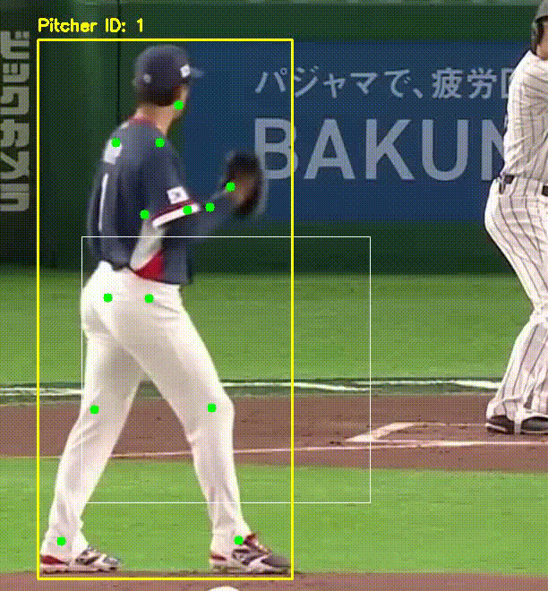

## 분석 출력 예시
모델이 영상을 분석하면 다음과 같은 결과가 출력됩니다.
```text
[1/3] Extracting pose from: example.mp4
[2/3] Preprocessing...
[3/3] Running inference...

📊 All Results (sorted by confidence):
  2021Goyoungpo.mp4               75.1%
  2014Hanhyunhee.mp4               8.5%
  2025Ohtani                       1.7%
  2019leeseungho                   1.3%
  2018kimkwanghyeon.mp4            1.2%
  2021Kimjaeyoon.mp4               1.1%
  2025SpencerSchwellenbach         0.7%

🎯 Result: 2021Goyoungpo.mp4 (75.1% confidence)
```
---

# 웹 어플리케이션 (UI/UX)
AI 모델을 사용자에게 제공하기 위한 Flask 기반의 웹 어플리케이션 영역입니다. 비동기 처리와 반응형 UI를 통해 쾌적한 분석 경험을 제공합니다.

## 시스템 아키텍처
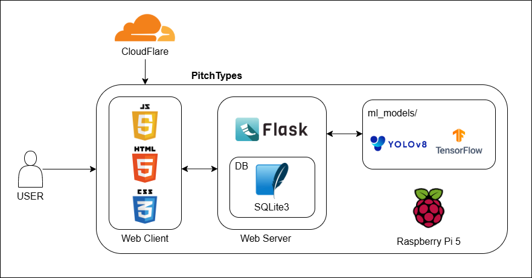

## 웹 어플리케이션 디렉토리 구조
유지보수와 확장성을 고려하여 라우터, 모델, 서비스 로직을 분리한 구조로 설계했습니다.
```
UIUX/
├── app.py                  # 어플리케이션 실행 엔트리포인트
├── config.py               # 데이터베이스 URL 및 모델 파일 경로 등 환경 변수 설정
├── seed.py                 # 프로 선수 시드 데이터를 데이터베이스에 초기 적재하는 스크립트
├── requirements.txt        # 패키지 의존성 목록
├── ml_models/              # 서비스 구동용 딥러닝 및 비전 모델 저장소
│   ├── pitch_model.h5
│   ├── pitch_label_encoder.pkl
│   ├── hit_model.h5
│   ├── hit_label_encoder.pkl
│   └── yolov8n-pose.pt
└── app/
    ├── __init__.py         # Flask App 팩토리 패턴 생성 및 DB, LoginManager 초기화
    ├── models/             # SQLAlchemy 기반 데이터베이스 ORM 클래스
    │   ├── analysis.py     # 사용자별 분석 기록 및 결과 데이터 모델
    │   ├── hitter.py       # 타자 프로필 및 설명 데이터 모델
    │   ├── pitcher.py      # 투수 프로필 및 설명 데이터 모델
    │   ├── ranking.py      # 명예의 전당 출력을 위한 랭킹 데이터 모델
    │   └── user.py         # 사용자 계정 및 통합 최고 점수 데이터 모델
    ├── routes/             # 사용자 요청 처리를 위한 Blueprint 라우터
    │   ├── api.py          # 비동기 파일 업로드, 상태 조회(Polling), 랭킹 피드 등 API 통신 담당
    │   ├── auth.py         # 비밀번호 해싱, 로그인 세션 관리, 프로필 수정 등 인증 담당
    │   └── main.py         # 메인, 랭킹, 마이페이지, 배틀, 분석 결과 등 화면 렌더링 담당
    ├── services/           # 비즈니스 로직 및 백그라운드 작업
    │   └── ml_service.py   # 영상 전처리, YOLO Pose 관절 추출, 모델 추론 등 AI 처리 스레드 로직
    ├── static/             # 정적 리소스
    │   ├── css/            # UI 스타일시트 파일
    │   ├── images/         # 서비스 로고 및 프로 선수 썸네일 이미지
    │   ├── results/        # 사용자가 캡처한 분석 결과 카드 이미지 저장소
    │   └── uploads/        # 사용자가 업로드한 원본 영상 및 프로필 이미지 저장소
    └── templates/          # Jinja2 템플릿 엔진을 활용한 프론트엔드 HTML 페이지
        ├── base.html       # 공통 레이아웃 (사이드바, 네비게이션 바 등)
        ├── index.html      # 메인 화면
        ├── upload_*.html   # 투구 및 타격 폼 영상 업로드 화면
        ├── result_*.html   # 투구, 타격, 고스트 배틀 개별 분석 결과 화면
        ├── battle.html     # 고스트 배틀 피드 및 대결 화면
        ├── ranking.html    # 명예의 전당 화면
        ├── mypage.html     # 사용자 개인 분석 기록 및 프로필 화면
        ├── roster.html     # 프로 선수 명단 및 검색 화면
        └── auth_*.html     # 로그인, 회원가입, 정보수정 관련 화면 모음
```
---

## 백엔드 플로우 차트  
다수 사용자의 영상 처리시 서버 동작의 동시성 확보를 위해 백그라운드 스레드를 Polling하여 비동기로 데이터를 처리합니다.

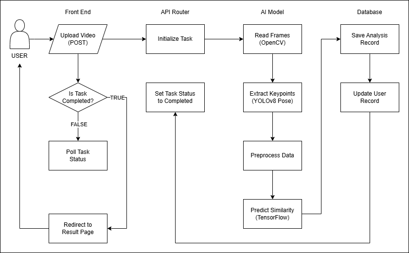
---

## 주요 기능 설명
### 1. 투구 및 타격 폼 AI 영상 분석 시스템  
사용자가 본인의 투구 혹은 타격 영상을 업로드하면 서버에서 이를 분석하여 어떤 선수와 가장 비슷한지 분석 결과를 출력합니다. 좌수자, 우수자 선택에 따른 맞춤형 전처리를 지원합니다. 결과 화면에서 제공되는 카드 이미지를 다운로드할 수 있습니다.
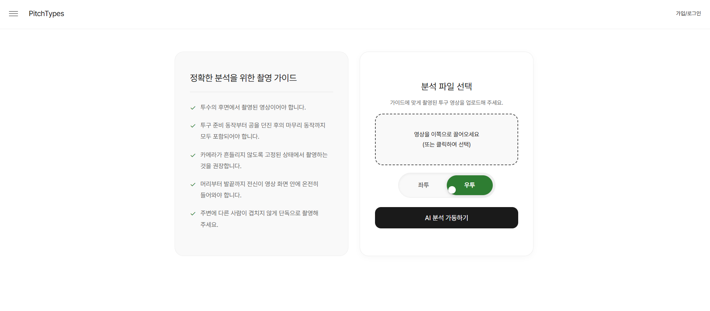
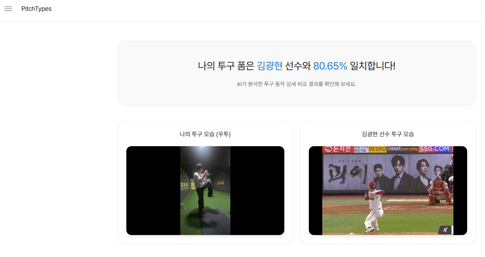
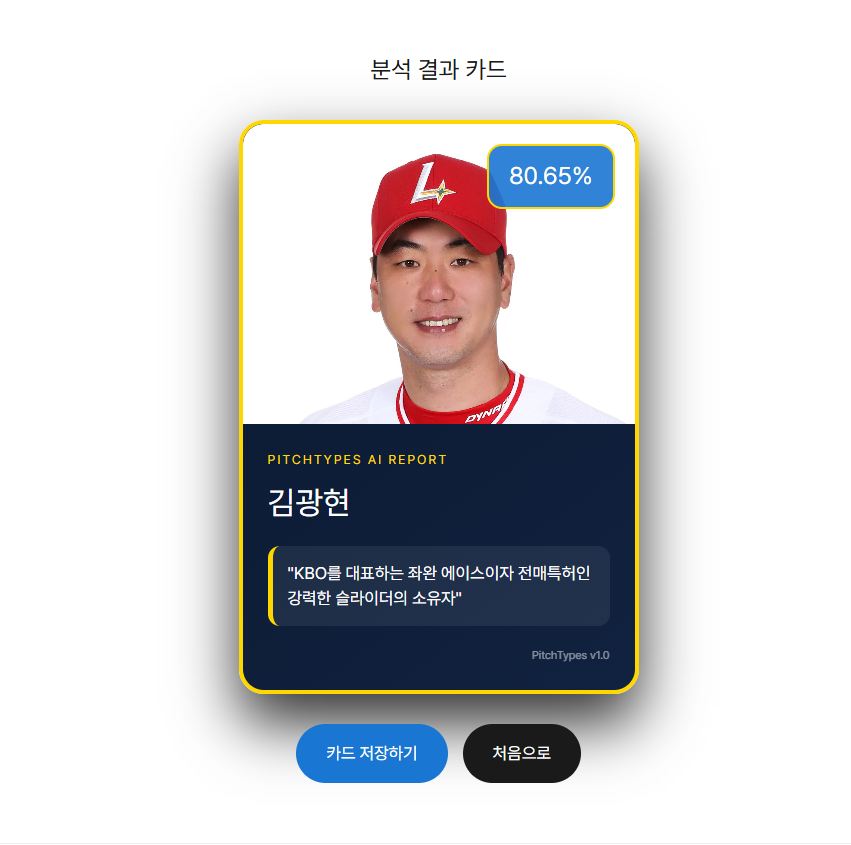

### 2. 명예의 전당 (랭킹)
가장 높은 유사도를 기록한 사용자들을 투수와 타자 부문으로 나누어 랭킹 페이지에 전시합니다. 랭킹 리스트에서 특정 유저를 클릭하면 마이페이지로 이동하도록 하여 페이지 간 연결성을 높였습니다.
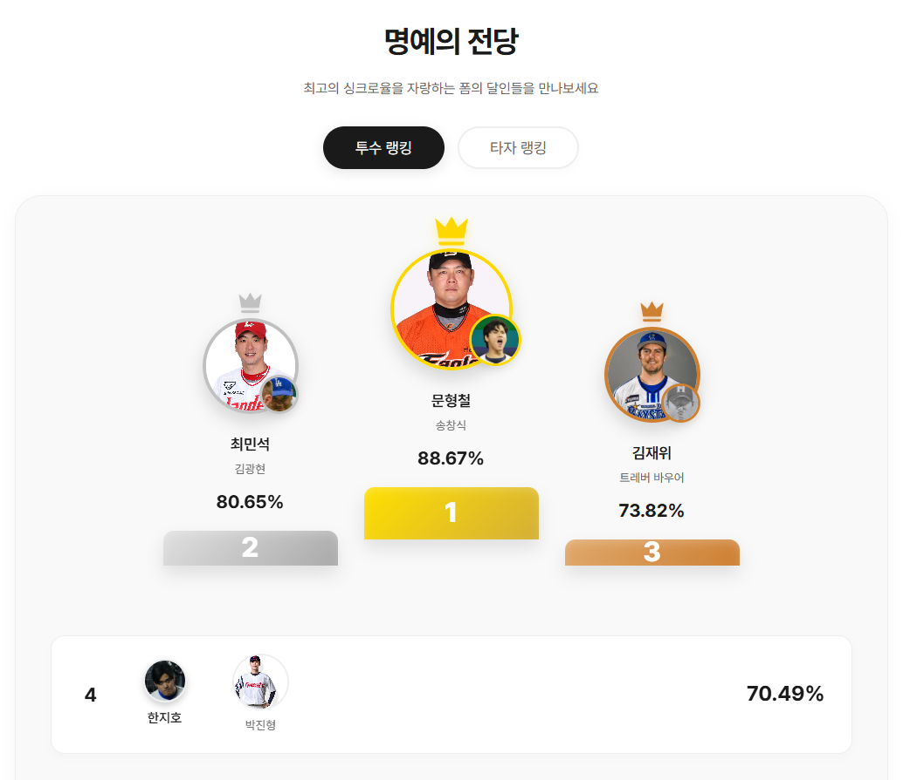

### 3. 고스트 배틀 모드
다른 유저들이 분석한 최근 기록들이 실시간 피드 형태로 제공되며, 다른 유저의 기록을 타겟으로 선택해 도전할 수 있습니다. 선수에 상관없이 산출된 유사도 점수를 바탕으로 승패를 판정합니다.
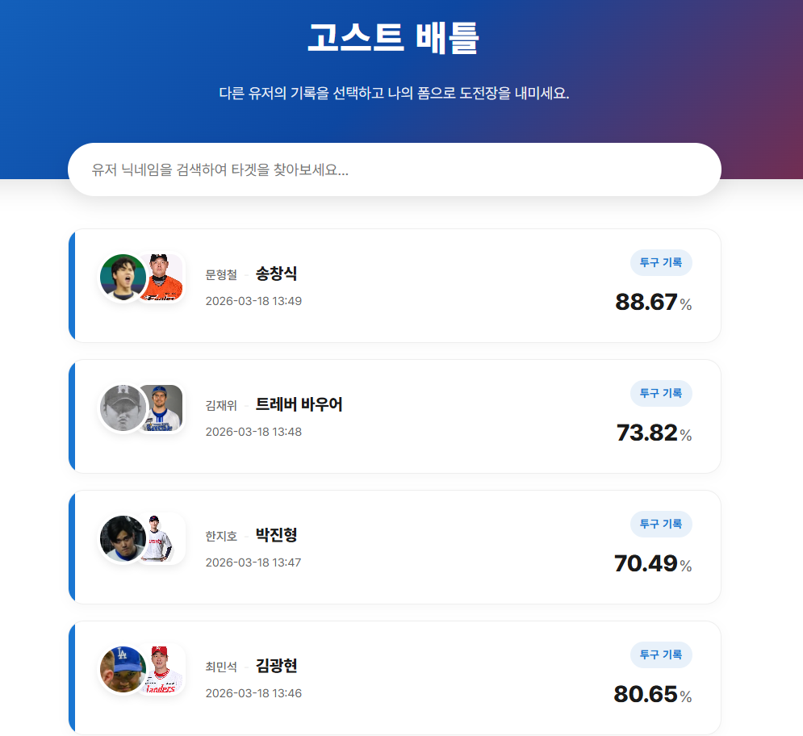
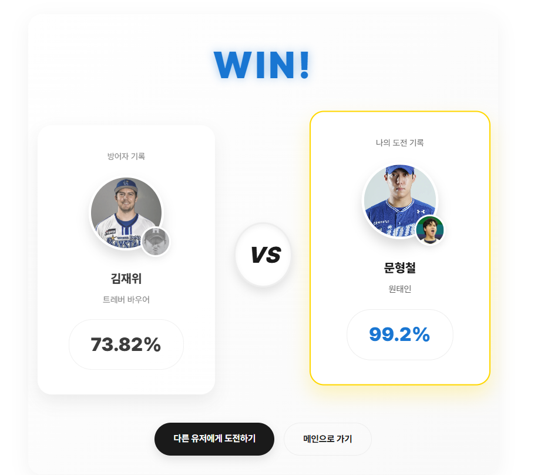

### 4. 사용자 인증 및 마이페이지
Werkzeug를 활용한 비밀번호 해싱 및 Flask-Login 기반의 안전한 세션 관리를 지원합니다. 마이페이지에서는 닉네임, 프로필 사진 변경을 지원하며, 본인이 진행한 과거의 모든 AI 분석 기록을 최신순으로 다시 열람할 수 있습니다.
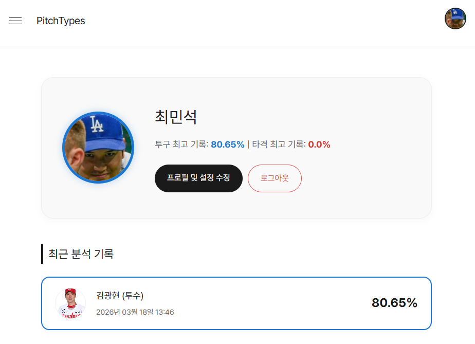

### 5. 프로 선수 명단 제공  
학습에 사용한 프로 선수들의 프로필 카드를 가나다순으로 정렬하여 제공합니다. 분석시 나타나는 선수 유형들을 전체적으로 열람할 수 있습니다.

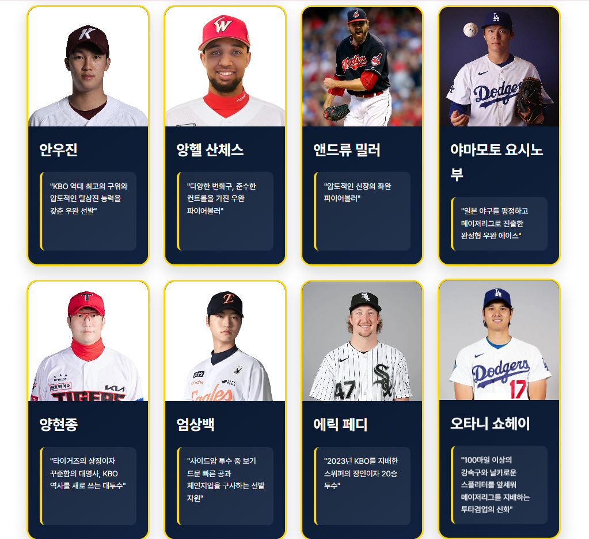
---

## 데이터베이스 구성
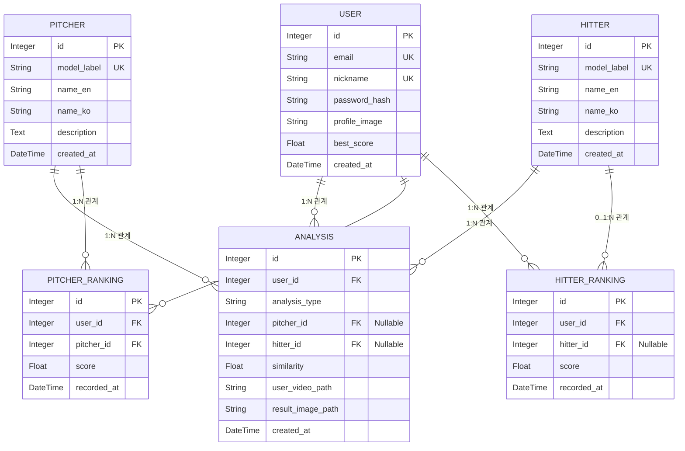
- USER: 서비스 이용자의 계정 정보를 저장합니다. 비밀번호는 평문으로 직접 저장하지 않고 Hashing을 사용해 저장합니다.
- PITCHER, HITTER: AI 모델이 학습하여 분류 대상으로 삼는 프로 선수들의 고유 레이블, 영문 및 한글 이름, 설명 등 기준 데이터를 저장합니다.
- ANALYSIS : 사용자가 영상을 업로드하여 분석을 수행할 때마다 생성되는 통합 기록 테이블입니다. 분석 종목(투구/타격), 매칭된 선수, 유사도 점수, 영상 및 캡처된 결과 카드의 저장 경로를 기록합니다.
- PITCHER_RANKING, HITTER_RANKING : 명예의 전당(랭킹) 페이지 조회를 최적화하기 위해, 사용자의 수많은 분석 기록 중 종목별 최고 점수만을 별도로 갱신하여 관리하는 테이블입니다.