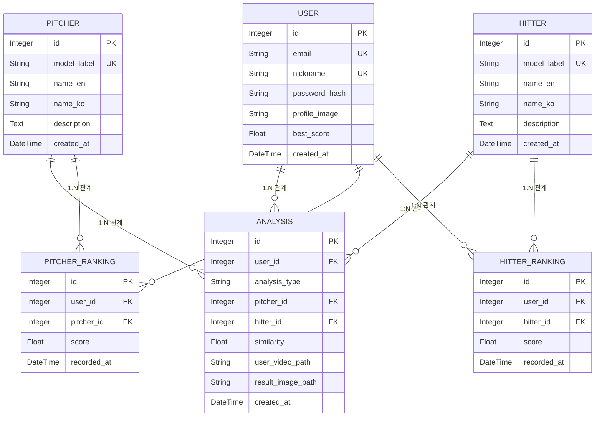

# AI_Pitching_analysis_system
- 모델 파트: 한지호, 김재위
- UI/UX 파트: 최민석, 문형철

# 실행 방법
1. 레포지토리 클로닝
```
git clone https://github.com/Hanjiho0316/AI_Pitching_analysis_system.git
```

2. 패키지 설치
```
pip install -r requirements.txt
```

3. 모델 배치
    학습이 완료된 모델 파일을 `AI_Pitching_analysis_system/UIUX/ml_models/`에 적재한다. 모델 파일 이름은 config.py에서 정의할 수 있다. 
    기본 값:
        - 투구 모델: pitch_model.h5, pitch_label_encoder.pkl
        - 타격 모델: hit_model.h5, hit_label_encoder.pkl

4. 시드 데이터 로드 
```
python UIUX/seed.py
```
    시드 데이터에는 모델이 학습한 투수와 타자의 이름과 설명 등이 포함된다.

5. 웹 서버 실행
```
python UIUX/app.py
```

# 프로젝트 디렉토리 구성
```
pitching_project/UI/UX
├── app.py                      # 웹 실행
├── config.py                   # 설정값 저장
├── seed.py                     # 시드 데이터 로드 (투수 및 타자 데이터)
├── requirements.txt            # pip 의존성 목록
├── app/
│   ├── __init__.py             # Flask app 생성 함수
│   ├── models/
│   │   ├── __init__.py
│   │   ├── analysis.py         # 분석 결과 데이터베이스 모델
│   │   ├── hitter.py           # 타자 데이터베이스 모델
│   │   ├── pitcher.py          # 투수 데이터베이스 모델
│   │   ├── ranking.py          # 랭킹 데이터베이스 모델 (투구/타격)
│   │   └── user.py             # 사용자 데이터베이스 모델   
│   ├── routes/
│   │   ├── __init__.py
│   │   ├── api.py              # api 호출 라우터 
│   │   ├── auth.py             # 인증 관련 라우터
│   │   └── main.py             # 메인 라우터
│   ├── services/
│   │   ├── __init__.py
│   │   └── ml_service.py       # 업로드 영상 모델 분석 (점수 보정 및 분석 ID 반환 로직 포함)
│   ├── static/
│   │   ├── css/                # 스타일 시트
│   │   ├── images/             # 웹 이미지 파일 디렉토리
│   │   ├── results/            # 캡처된 분석 결과 카드 이미지 저장 디렉토리
│   │   ├── uploads/        
│   │   │   ├── profiles/       # 사용자 프로필 이미지 디렉토리
│   │   │   └── videos/         # 사용자 업로드 비디오 디렉토리
│   │   └── videos/
│   │       ├── hitters/        # 타자 원본 비디오 디렉토리
│   │       └── pitchers/       # 투수 원본 비디오 디렉토리
│   └── templates/
│       ├── base.html           # 부모 HTML 파일 (nav + sidebar)
│       ├── battle.html         # 고스트 배틀 메인 화면 (실시간 피드)
│       ├── edit_profile.html   # 사용자 정보 수정 화면
│       ├── failure.html        # 분석 실패 화면
│       ├── index.html          # 메인 화면 (투구/타격 분할)
│       ├── login.html          # 로그인 화면
│       ├── mypage.html         # 마이페이지 화면 (분석 카드 모달 뷰 포함)
│       ├── passwd.html         # 비밀번호 변경 화면
│       ├── ranking.html        # 랭킹 화면 
│       ├── result_battle.html  # 대결 전용 결과 화면
│       ├── result_hit.html     # 타격 폼 분석 결과 화면
│       ├── result_pitch.html   # 투구 폼 분석 결과 화면
│       ├── settings.html       # 설정 화면
│       ├── signup.html         # 회원가입 화면
│       ├── upload_hit.html     # 타격 영상 업로드 화면
│       └── upload_pitch.html   # 투구 영상 업로드 화면
├── ml_models/                  # 투구 및 타격 모델 저장 디렉토리
└── data/
```
- html 파일들에는 빨간줄떠도 실행에는 문제 없음

# 데이터베이스 구성


# 투타 대결: 고스트 배틀
- 랭킹 페이지 혹은 유저 찾기 기능으로 붙을 유저 탐색
- 유저의 타격, 투구 마지막 혹은 베스트 기록으로 배틀
- 점수가 더 높으면 승리, 아니면 패배

# 오늘 할 일
- 밥먹고와서 잼민이 새 채팅 파기
- 좌투좌타 변환?? (버튼)
- YOLO 기반 투구 모델로 교체하기 (+백엔드 수정 필요)

- 메인 화면에 배틀로 가는 버튼 만들기 + 로고 만들기
- 모델 학습 코드 팔로우업
- 백엔드 플로우차트 작성
- 문서 작업
- 디자인 향상?
