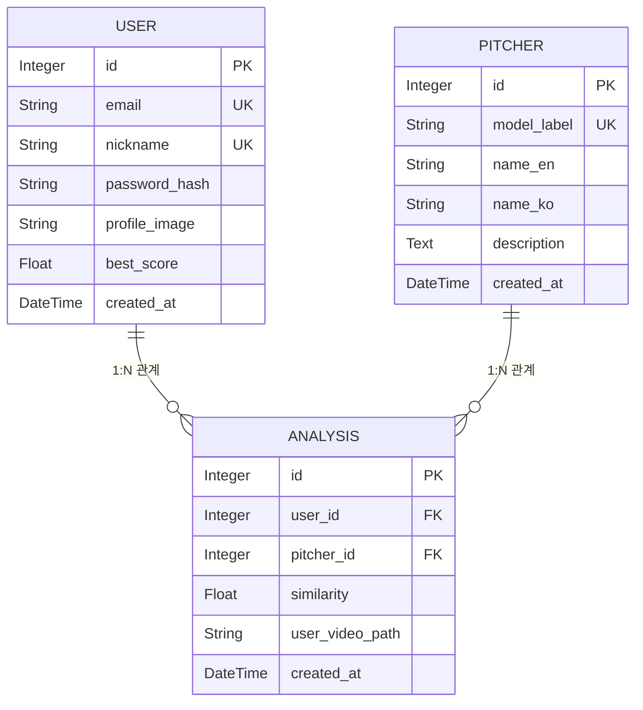

# AI_Pitching_analysis_system
- 모델 파트: 한지호, 김재위
- UI/UX 파트: 최민석, 문형철

# 실행 방법
1. 레포지토리 클로닝
```
git clone https://github.com/Hanjiho0316/AI_Pitching_analysis_system.git
```
2. 패키지 설치
```
pip install -r requirements.txt
```
3. 모델 배치: 학습이 완료된 모델 파일을 `AI_Pitching_analysis_system/UIUX/ml_models/`에 적재한다. (best_model_fold.h5, label_encoder.pkl)
4. 시드 데이터 로드 
```
python UIUX/seed.py
```
5. 웹 서버 실행
```
python UIUX/app.py
```

# 프로젝트 디렉토리 구성
```
pitching_project/UI/UX
├── app.py                      # 웹 실행
├── config.py                   # 설정값 저장
├── seed.py                     # 시드 데이터 로드
├── requirements.txt            # pip 의존성 목록
├── app/
│   ├── __init__.py             # Flask app 생성 함수
│   ├── models/
│   │   ├── __init__.py
│   │   ├── analysis.py         # 분석 결과 데이터베이스 모델
│   │   ├── pitcher.py          # 투수 데이터베이스 모델
│   │   └── user.py             # 사용자 데이터베이스 모델   
│   ├── routes/
│   │   ├── __init__.py
│   │   ├── api.py              # api 호출 라우터
│   │   ├── auth.py             # 인증 관련 라우터
│   │   └── main.py             # 메인 라우터
│   ├── services/
│   │   ├── __init__.py
│   │   └── ml_service.py       # 업로드 영상 -> 모델 분석
│   ├── static/
│   │   ├── css/                # 스타일 시트
│   │   ├── images/             # 웹 이미지파일 디렉토리
│   │   │   ├── pitchers/       # 선수 프로필 이미지 디렉토리
│   │   ├── uploads/        
│   │   │   ├── profiles/       # 사용자 프로필 이미지 디렉토리
│   │   │   └── videos/         # 사용자 업로드 비디오 디렉토리
│   │   └── results/            # 사용자 분석 결과 이미지 저장
│   └── templates/
│       ├── base.html           # 부모 HTML 파일 (nav + sidebar)
│       ├── battle.html         # 투구 폼 대결 화면 (미구현)
│       ├── edit.html           # 사용자 정보 수정 화면
│       ├── failure.html        # 분석 실패 화면 (dummy)
│       ├── index.html          # 메인 화면
│       ├── login.html          # 로그인 화면
│       ├── mypage.html         # 마이페이지 화면
│       ├── passwd.html         # 비밀번호 변경 화면
│       ├── ranking.html        # 랭킹 화면
│       ├── result.html         # 분석 결과 화면
│       ├── settings.html       # 설정 화면
│       ├── signup.html         # 회원가입 화면
│       └── upload.html         # 영상 업로드 화면
├── ml_models/                  # 모델 저장 디렉토리
└── data/
```

# 데이터베이스 구성
